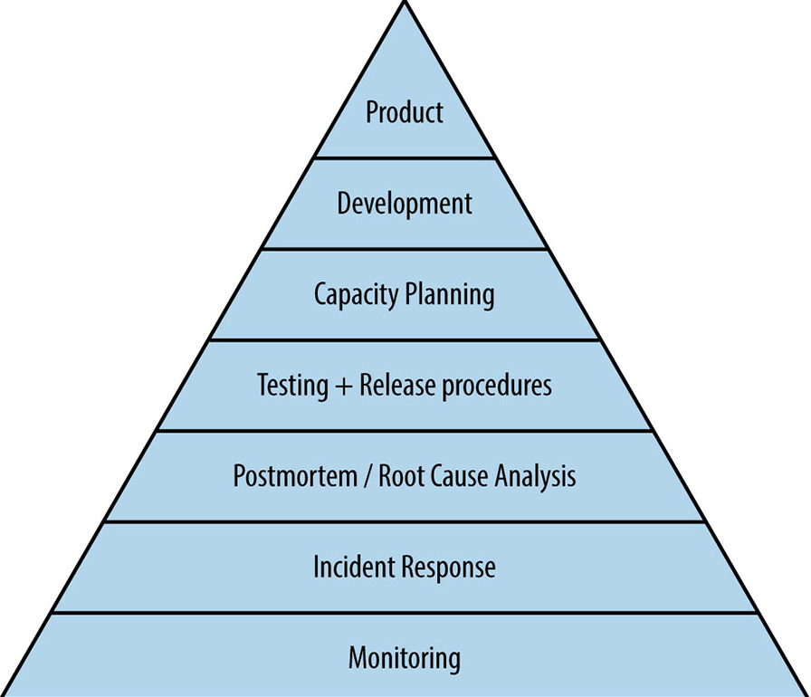

# SRE简介

> SRE是指Site Reliability Engineer (网站可靠性工程师)。他是软件工程师和系统管理员的结合，一个SRE工程师基本上需要掌握很多知识：算法，数据结构，编程能力，网络编程，分布式系统，可扩展架构，故障排除。 - 百度百科

* Site： 一个网站
* Reliability： 被定义为"值得信赖的质量或一贯可靠的质量"
* Engineering： 被定义为"熟练地运用技巧以达到某种目的的行动"

# 《SRE 生存指南》- Nat Welch

> 系统中断响应与正常运行时间最大化

## 语录

* 故障是常态，正常才是异常
* 个人不应该害怕事故，而是要确信如果事故发生，团队将会响应和改进系统，而不是关注发生事故带来的耻辱和愤怒。事故是我们可以从中学习的东西，而不是让人害怕和羞耻的事情！

##  1. 简介

* SRE的目标是提高服务可靠性，帮助业务实现并改善用户的服务体验
* SRE定义： 一个专注于熟练地维护一个网站以使其持续可靠的领域

> 互联网上的软件永远做不到完全可靠，这里有两个原因
>
> 1. 互联网是一个分布式系统，各部分经常出现故障，这会影响服务可用性。
> 2. 软件是人编写的，所以Bug不可避免，而Bug会导致系统宕机。

* 可靠性层次结构 Mikey Pyramid

  

    1. 用户体验
    2. 开发
    3. 容量规划
    4. 测试与发布
    5. 事后回顾
    6. 事故响应
    7. 监控
  
  > 以上七点都被**沟通**所包围，因为每一层都需要沟通才能成功。
  
* 在加入或新项目评估新服务时，请遵循下面的一系列步骤

  1. 弄清楚团队结构。团队里谁负责什么？谁说了算？
  2. 查找团队为其服务或项目编写的任何文档。
  3. 让某人绘制出系统架构图。让他们向你展示什么连接到哪个服务、什么依赖于这个项目、数据如何流经服务，以及项目如何部署。

* 进行每个环节时提出以下问题

  * 服务有监控机制吗？
  * 团队有事故响应的计划吗？
  * 团队有事故回顾报告吗？它们存放在哪里？
  * 服务是怎么被测试的？项目有发布计划吗？
  * 有人曾经做过扩展计划吗？
  * 能使用什么工具来改进服务？
  * 当前的可靠性水平是否提供了令人满意的用户体验？

  > 人的时间和精力都是有限的，因此你总是需要与更多的人共同协作，所以一定要慢慢来。
  > 走慢点意味着事情不那么容易会被遗漏。你也不希望每个服务的基础还没来得及打好就崩塌了。

## 2. 监控

首先需要确定质量标准是什么，并确保系统持续逼近或保持在质量标准极限范围内。其次需要系统地关注这项工作而不是随机地查看一下系统。

### 监控的类型

1. 指标

   即性能数字，例如磁盘空间使用率、接收的数据包数量、CPU负载等等

2. 日志

   日志用来记录事故，通常也包含一些数字与数据，但往往结构松散。有些是完整的`json`数据块，有些是人工格式的文本字符串

对于Web程序最常见的指标是错误数、请求数和请求持续时间，最常见的日志是错误堆栈跟踪。

简称

* `ERD (Error Counts, Request Counts, Request Duration)`或`RED`

* `REL (Requests, Errors, Latency)` 

  > 我比较喜欢第二种称呼，容易理解

监控应用三连：

1. 怎么知道服务处于正常状态？
2. 怎么知道它不正常？
3. 如何定义它是正常的？

**从基础开始**

如果你的服务是Web服务器，那么首先要确保能够收集错误数、请求数和请求持续时间`ERD`

对于后台服务使用`IDS (Instrusion Detection Systems) 入侵检测系统`

有了基础才能开始扩展

用户通过上传服务器上传图片，后上传服务器写入本地磁盘并检查这些图片，将元数据存储到数据库中，然后将图片上传到云存储服务

哪些指标可以告诉你此服务器正在执行工作？

* 请求错误数、请求持续时间和请求总数(**ERD**)： 因为这是Web服务器，也是监控的底线
* 上传的字节数： 这将说明所使用的网络带宽。因为一些请求可能非常大，但因为并非每个请求都是一样的，我们想知道进入服务器的数据量是否开始出现峰值。
* 图像大小(以字节为单位)： 这从不同的角度提供了相同的信息。在接收到字节并对其进行处理之后，最终的图像有多大？例如，通过这种途径，如果上传客户端发生变化(例如新的iPhone使用更高像素的镜头，或者在图像发送前使用压缩算法对图像进行压缩)，那么我们可以看到与调整网络带宽对比的效果。
* 上传的图片： 此指标仅在看到重大变化时才有用。如果遇到了与之前差异非常大的图片，这或许可以解释是什么导致了系统服务中断。
* 数据库中的图像元数据记录数： 将其记录数与上传的图像数量进行比较，以确保在数据库关闭时不会丢弃图像数据
* 存储中的图像数量： 这可以确保图像最终被正确保存。如果没有正确保持，则可能云存储已关闭或存在网络问题

### 黑盒监控与白盒监控

在考虑要监控的内容时，通常有两个考虑的方向 - 黑盒监控和白盒监控。

黑盒监控假设监控工具对应用程序一无所知或知之甚少。通常它是一个探测或一系列常规请求，以检查事情是否按预期方式工作。

白盒监控是对代码的监测。它知道程序是如何工作的，因为它来自程序内部。如果以飞机的电子设备进行类比，那么白盒监控就是驾驶仓内的仪表，黑盒监控则是飞机飞过无线电塔是发送和接收的更新。

### SLI、SLO 和错误预算简介

* **SLI** `Service Level Indicator` 服务水平指标

> 对于业务来说可能是最重要的指标。对网站来说，一个常见的SLI是请求得到正常响应的百分比；对于其他类型服务来说，SLI可以是性能指标，例如在100ms内返回搜索结果的百分比。

* **SLO** `Service Level Objective` 服务水平目标

  > 是围绕SLI构建的目标。它通常是一个百分比，并与一个时间范围挂钩。例如，时间段是最后30天、最后24小时、当前财务季度等等。它通常以一个带有一连串9的数字来度量。如果有人用99.999来形容连续运行时间，通常他们是在说服务持续运行时间的百分比。脱离了时间的度量，SLO的意义就不是那么大了，所以我们通常假设人们所说的是之过去30天内滚动累计平均值。

  以下是SLO的一些示例

  * 90% (1个9的正常运行时间)： 这意味着10%的停机时间，也就是说在过去30天里停机了3天。
  * 99% (2个9的正常运行时间)： 这意味着过去30天中有1%，或者说7.2小时的停机时间。
  * 99.9% (3个9的正常运行时间)：意味着0.1%，或者说43.2分钟的停机时间。
  * 99.95% (3.5个9的正常运行时间)： 意味着0.05%，或者说21.6分钟的停机时间。
  * 99.99% (4个9的正常运行时间)： 意味着0.01%，或者说4.32分钟的停机时间。
  * 99.999% (5个9的正常运行时间)： 意味着0.001%，或者说26秒的停机时间

> 数量级通常是10的倍数。我们通常把事情看成几个数量级，因为只有这样才能发现问题。例如，如果你可以做10件事，那么可能也可以做40件事，但并不意味着你能做100或1000件这样的事情。

* SLA `Service Level Agreement` 服务水平协议

  > 是企业围绕SLO发布的协议。通常它要求在不满足SLO时向客户提供货币补偿。这在**软件即服务(Software as a Service, SaaS)**的公司中最为常见，其他公司也会有这种情况。
  >
  > 发布SLA的公司通常也拥有比发布的SLA更严格的内部SLO，这样做公司可以在一定程度上规避向客户赔付的风险。

* 错误预算

  > 并非每个服务都需要SLO和错误预算，但它们可以成为非常有用的工具，以确定何时可以安全地承担风险。有时，人们会说"信任但要验证"或"请以数据来支持你的说法"。在承担可能影响业务的风险时，这很重要。就像你想知道人力资源团队是否及为何要改变你的健康保险一样，你的同事希望知道，你只是以一种企业可以处理的方式来承担风险。
  >
  > 如果你走进一间没有数据的房间说"是的，一切都会好的"，这并不能令人信服。如果你能展示数据并说"你可以信任我们，因为我们在过去一个月内完成了100次部署而没有导致停机，并且如果这次确实失败了，也可以回滚并保证仍然在我们商定的SLO范围内。如果由于故障的发生，本月没有满足SLO，那么我们将停止部署，直到事情稳定下来并重新达到我们的共识"，这就好多了。
  >
  > **SLO绝不是工作被优先考虑的唯一原因。如果只追求SLO，那么你的团队可能会发现自己与业务需求非常脱节。如果发生这种情况，请先退后一步，通过团队合作和与管理层沟通来更好地找准自己在组织中的定位。**

### 收集和保存监控数据

* 轮询应用程序

  > 轮询(也称为 Pull 拉取)程序从服务器中抓取数据，然后存储并显示数据。轮询应用程序的缺点是，需要保留一些关于所有服务的记录，以备不时之需。这不是这类程序的问题，但需要考虑的问题是： 如何知道服务器上正在运行哪些服务？轮询应用非常广泛，从谷歌这样的公司到想监视自己家Wi-Fi路由器的人都在使用这类程序。

* 推送应用程序

  > 推送应用程序与轮询应用程序刚好相反。它不是从服务上主动抓取指标数据，而是被动地由服务向它传送指标数据。通常这里会存在一个中间服务，它负责把指标数据转换和聚合，然后将它们传给中央监控程序。推送应用程序常被吐槽的一点是，如果许多服务同时向它传送数据，则可能会出现问题。但推送应用程序本身没有任何问题，它们只是具有不同的架构。与轮询应用程序一样，有很多大大小小的公司使用推送应用程序，并且行之有效。

### 展示监控信息

收集数据并将其保存到数据存储中之后，就可以向用户展示这些数据了。许多监控工具都提供了自己的可视化系统。有些其他工具则建议你构建自己的可视化系统。一个流行的开源可视化工具是Grafana。

无论你使用什么来实现可视化和访问指标，人们通常会使用4类工具来获取和共享数据。

* 任意查询

  > 每个人都需要能够自己创建查询来访问自己构建的指标和日志，原因很简单：如果人们无法访问他们，指标就毫无用处。虽然你可以为大家创建图标和仪表盘，但是工作时通常会遇到一些新的问题，需要针对指标数据存储创建新的查询以解决问题。你当然想让同事能够在没有你的情况下也能完成他们的工作。但如果你是唯一可以查询的人，那么你将很快成为"查询执行者"，或者没有人会关注指标。这两种结果对你来说都不算明智。

* 图表

  > 图表主要用作随时间变化的数据的可视化展示。米勒定律指出，一般人头脑中只能容纳不到10个对象(因此很难记住具有很长一串数字的表格)，但是你却可以使用一个图表一次显示数千个数字。
  >
  > 图表的典型使用规则如下
  >
  > * X轴(图形的下边缘)包含时间。
  > * 无论绘制什么，都必须有一个键。
  > * 所有的轴都必须标记。
  > * 所有的数字都必须有单位。

* 仪表板

  > 构建仪表板的最佳规则是让用户看到他们需要的数据。如果你是为你自己或你的团队设计仪表板，请记住以下建议和注意事项
  >
  > * 如果打算在电视机上展示仪表板，请确保它只有几个图表，并且可以从很远的地方看清楚。如果必须跑过整个房间来到电视机旁边才能看清楚，那它可能没有达到应有的效果。
  > * 如果可以的话，让仪表板支持移动设备。越来越多的工程师首先在手机上检查故障和图表，然后才打开笔记本电脑进行深入排查。
  > * 有人建议在仪表板上一次最多展示5个图表，保留前3个图表以显示关于服务的最重要的内容。这样当页面首次加载时，最上面的内容就是你应该首要关注的地方。一个好办法是设置到其他仪表板的链接。如果你有一个关于网络流量的图表，那么下面要有指向仪表板的链接，其中包含有关网络的详细信息，以防图表显示出问题。

* 聊天机器人

  > 一个非常有用的工具是能够让图表出现在聊天中，或者能够从聊天中请求图表。Github在其博客中写道，他们只需要在Slack中输入 `/graphme 20150517..20150523 @github.deploys.total`，就可以获取`github.deploys.total`从`2015年5月17日至2015年5月23日`的带有指标数据的图表。

### 管理和维护监控数据

1. 经典的、经过验证的且真实的方法 - 付钱请别人去做。自己不用去操心监控服务器是否故障、磁盘空间是否满了
2. 自己构建监控系统的问题
   1. 磁盘空间
      1. 计算收集的数据量大小以及消耗存储空间的速度。如果空间有限则需要在某个时刻开始删除历史数据。解决这个问题的两种常见方法是抽样和归档。
      2. 投入更多的存储空间，因为硬盘价格一年比一年低。

### 他们知道有监控吗

他们可以是你的老板、产品团队、工程团队或者你认为应该关心监控服务的任何其他人。首先要告诉他们有新的监控系统，一个包含示例图标、文档链接和仪表板的精心编写的电子邮件是第一步，这是远远不够的。下一步是以正经的语气发送消息，展示有用的图表或仪表板。例如一个令人兴奋的宣告"你看到网站上个月有多少请求了吗？"

第一步只是告知监控存在。

第二部是将其与你的生活融为一体，并不断向其他人展示其实用性。

## 事故响应

事故响应属于`Mikey Pyramid`中监控的下一个层次。事故响应建立在使用监控系统构建的数据之上，并借助反馈循环，来帮助我们加强对服务的监控。

这向我们展示了什么是重要的。因为如果没有警报，而是有人告诉我们服务没有正常工作，那么我们的监控就是不到位的。

#### 什么是事故响应

事故响应通常包含以下几个动作

1. 关注，注意到有些东西不对劲

   > 关注是通过警报来实现的。警报就像一个110呼叫 - 来自一个在软件中看到错误的人的求救信息
   >
   > 人工上报可能很有用，但通常最好从自动化系统接收警报。
   >
   > 自动化系统与人类不同，它们是一致的。

2. 交流，告诉别人哪些东西不对劲

3. 恢复，纠正不对劲的东西