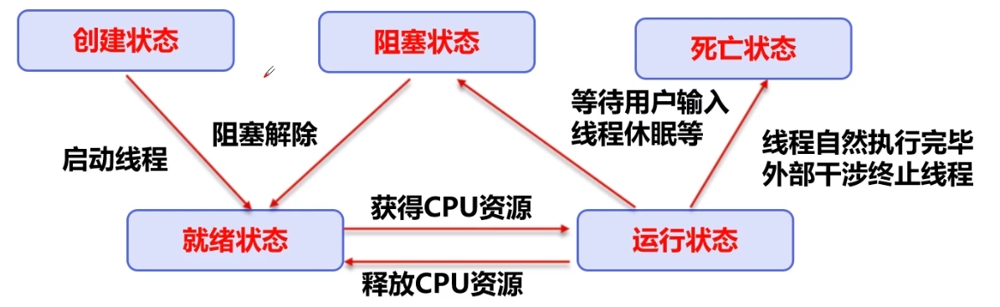
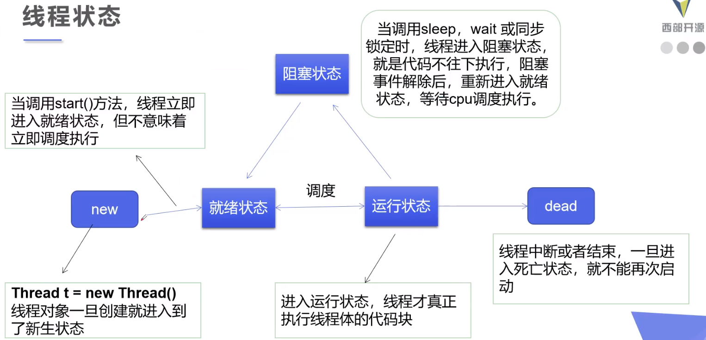
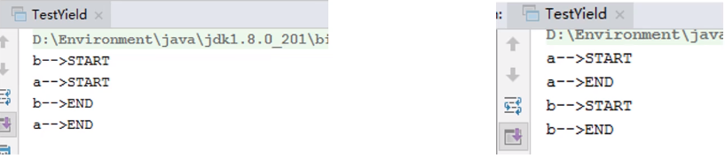

观看至： [https://www.bilibili.com/video/BV1V4411p7EF?p=17](https://www.bilibili.com/video/BV1V4411p7EF?p=17)

### 什么是任务、进程、线程

* 多任务表示一个人边吃饭边玩手机，看上去是同时进行，实际上这一秒在吃饭下一秒在玩手机，只是切换时间很短感觉不出来
* 说道进程就得提程序，程序运行会创建一个进程，里面包含一个主线程如`main`函数，还有其他语言自带的守护线程如Java的`GC`
* 线程不一定立即执行，它是由CPU调度的

### 线程的三种创建方式

* Thread `class` 继承Thread类

  * **不建议使用： 避免OOP单继承局限性**
  * 创建一个`Class`继承`Thread class`并重写`run()`方法，启动线程使用`.start()`

  ```java
  package com.painso.study.thread.demo01;
  // create thread way 1: extend Thread class, override run() method, call start enable thread
  public class D1 extends Thread{
      @Override
      public void run(){
          // run() body
          for (int i = 0; i<20;i++){
              System.out.println("i'm run() body "+i);
          }
      }
      public static void main(String[] args) {
          // main() body
          D1 d1 = new D1();
          d1.start();
          for (int i = 0; i < 20; i++){
              System.out.println("i'm main() body "+i);
          }
      }
  }
  ```

  

* Runnable `interface` 实现Runnable接口

  * **建议使用： 避免单继承局限性，方便灵活，方便同一个对象被多个线程使用**
  * 创建一个`Class`实现`Runnable`接口并重写`run()`方法，启动线程使用`new Thread(p).start()`

  ```java
  package com.painso.study.thread.demo03;
  // create thread way 2: implement Runnable interface, override run() method, call Thread(p).start()
  public class D implements Runnable {
      @Override
      public void run() {
          System.out.println("i'm a thread implement Runnable interface");
      }
      public static void main(String[] args) {
          // create Runnable interface implement Object
          D d = new D();
          // create thread Object
          Thread thread = new Thread(d); // agent
          thread.start();
      }
  }
  ```

  

* Callable `interface` 实现Callable接口

### 初识并发问题

* 当多个线程操作同一个资源会导致线程不安全从而出现一些奇怪的问题

  ```java
  package com.painso.study.thread.demo04;	
  // 多个线程同时操作同一个对象
  // 买火车票的例子
  public class D1 implements Runnable {
    // 票数
    private int ticketNums = 10;
    @Override
    public void run() {
        while (true) {
            if (ticketNums <= 0) {
                break;
            }
            // 模拟延时
            try {
                Thread.sleep(200);
            } catch (InterruptedException e) {
                e.printStackTrace();
            }
  System.out.println(Thread.currentThread().getName() + "拿到了第" + ticketNums-- + "张票");
  //            ticketNums--;
        }
    }
    public static void main(String[] args) {
        D1 ticket = new D1();
        new Thread(ticket, "小麦").start();
        new Thread(ticket, "小红").start();
        new Thread(ticket, "小明").start();
    }
  }
  /* output
  小麦拿到了第10张票
  小红拿到了第9张票
  小明拿到了第8张票
  小麦拿到了第7张票
  小红拿到了第6张票
  小明拿到了第5张票
  小麦拿到了第4张票
  小红拿到了第3张票
  小明拿到了第2张票
  小麦拿到了第1张票
  小红拿到了第0张票
  小明拿到了第-1张票
  */
  ```

  要解决上述问题需要用到锁

* 案例： 龟兔赛跑 `rabbit tortoise race` **即使跑的再慢也不能停止脚步**

  1. 首先设置赛道距离，需要离终点越来越近
  2. 判断比赛是否结束
  3. 打印出胜利者
  4. 龟兔赛跑开始
  5. 设定兔子需要睡觉，需模拟兔子睡觉
  6. 乌龟赢得比赛

  ```java
  package com.painso.study.thread.demo05;
  
  // 模拟龟兔赛跑
  public class D implements Runnable {
  
      // 胜利者 胜利者只有一个这里用 static 关键字
      private static String winner;
      @Override
      public void run() {
          for (int i = 0; i <= 100; i++) {
              String role = Thread.currentThread().getName();
              // 判断比赛是否结束
              boolean flag = isGameOver(i);
              // 如果比赛结束则停止程序
              if (flag) {
                  break;
              }
              // 模拟兔子休息
              if (role.equals("Rabbit") && i % 10 == 0) {
                  try {
                      Thread.sleep(200);
                  } catch (Exception e) {
                      e.printStackTrace();
                  }
              }
              //  模拟乌龟速度
              if (role == "Tortoise") {
                  try {
                      Thread.sleep(10);
                  } catch (Exception e) {
                      e.printStackTrace();
                  }
              }
              System.out.println(role + "离终点还有" + (100 - i) + "米");
          }
      }
      // 判断比赛是否完成
      private boolean isGameOver(int steps) {
          // 判断是否有胜利者
          if (winner != null) {
              return true;
          }
          // 判断是否有角色到达终点
          if (steps >= 100) {
              winner = Thread.currentThread().getName();
              System.out.println("winner is " + winner);
              return true;
          }
          return false;
      }
      public static void main(String[] args) {
          D race = new D();
          new Thread(race, "Rabbit").start();
          new Thread(race, "Tortoise").start();
      }
  }
  ```

### **Callable** 接口

	1. 实现`Callable`接口，需要返回值类型
 	2. 重写`call`方法，需要抛出异常
 	3. 创建目标对象
 	4. 创建执行服务： `ExecutorService ser = Executors.newFixedThreadPool(1)`
 	5. 提交执行： `Future<Boolean> result1 = ser.submit(t1)`
 	6. 获取结果： `boolean result = result1.get()`
 	7. 关闭服务： `ser.shutdownNow()`

### 静态代理模式

* 

* 真实对象和代理对象都要实现同一个接口

* 代理对象接受真实对象为参数

* 代理对象可以为真实对象做额外操作，而真实对象只需关注本身

  ```java
  package com.painso.study.thread.demo06;
  public class ThreadProxy {
      public static void main(String[] args) {
          // 静态代理
          new WeddingCompany(new You()).Marry();
          // 类比实现了Runnable接口的对象
          new Thread(() -> System.out.println("aaa")).start();
      }
  }
  interface Marry {
      void Marry();
  }
  class You implements Marry {
      @Override
      public void Marry() {
          System.out.println("张三结婚了");
      }
  }
  class WeddingCompany implements Marry {
      private Marry role;
  
      public WeddingCompany(Marry role) {
  
          this.role = role;
      }
      private void before() {
          System.out.println("布置。。。。。。。");
      }
  
      private void after() {
          System.out.println("结帐。。。。。");
      }
      @Override
      public void Marry() {
          before();
          this.role.Marry();
          after();
  
      }
  }
  ```

### Lambda 表达式

* Lambda，是第十一个希腊字母。 大写`Λ`用于： 粒子物理学上，Λ重子的符号 宇宙学及物理学上，爱因斯坦宇宙学常量的符号 数学上，三角形函数的符号 小写`λ`用于： 物理上的波长符号 放射学的衰变常数 线性代数中的特征值

* 避免匿名内部类定义过多

* 其实质属于函数式编程的概念

* ```java
  /*
  (params) -> expression
  (params) -> statement
  (params) -> { statements }
  a -> System.out.println("i like lambda-->"+a);
  */
  package com.painso.study.thread.demo07;
  
  public class Lambda {
      public static void main(String[] args) {
          new Thread(() -> System.out.println("i'm lambda, Thread name: " + Thread.currentThread().getName()),"WeaponX").start();
      }
  }
  ```

* 函数式接口

  * 任何接口如果只包含唯一一个抽象方法，那么它就是一个函数式接口。

    ```java
    public interface Runnable{
        public abstract void run();
    }
    ```

  * 对于函数式接口，我们可以通过`Lambda`表达式来创建该接口的对象。

### 多线程五大状态

* 线程的生命周期 `lifecycle`
  * 
  * 

* 线程方法

  * | 方法                           | 说明                                       |
    | ------------------------------ | ------------------------------------------ |
    | setPriority(int newPriority)   | 更改线程的优先级                           |
    | static void sleep(long millis) | 在指定的毫秒数内让当前正在执行的线程休眠   |
    | void join()                    | 等待该线程终止                             |
    | static void yield()            | 暂停当前正在执行的线程对象，并执行其他线程 |
    | void interrupt()               | 中断线程，不推荐使用                       |
    | boolean isAlive()              | 检查线程是否处于活动状态                   |

  * 停止线程

    * 不推荐使用JDK提供的`stop()、destroy()`方法  已废弃
    * 推荐线程自己停止
    * 建议使用一个标志位进行终止变量 -> `if flag==false`则终止线程运行

  * Sleep
    * 每个对象都有一个锁，`sleep`不会释放锁。

  * 线程礼让 **Yield**

    * 礼让线程，让当前正在执行的线程暂停，但不阻塞

    * 将线程从运行状态转为就绪状态

    * **让CPU重新调度，`Yield`不一定成功，看CPU心情

      > 假设有A和B两个线程，启动主程序时CPU安排A先进入调度，但是A使用了`Yield`方法，从而回归最开始的就绪状态重新让CPU安排调度

      

  * Join

    * Join合并线程，待此线程执行完成后，再执行其他线程，此时其他线程处于阻塞状态
    * 理解为线程之间插队

### 线程状态观测

* Thread.State

  线程状态可以处于以下状态之一

  一个线程可以在给定的时间点处于一个状态。这些状态是不反映任何操作系统线程状态的虚拟机状态。

  * NEW

    > 尚未启动的线程处于此状态

  * RUNNABLE

    > 在Java虚拟机中执行的线程处于此状态

  * BLOCKED

    > 被阻塞等待监视器锁定的线程处于此状态

  * WAITING

    > 正在等待另一个线程执行特定动作的线程处于此状态

  * TIMED_WAITING

    > 正在等待另一个线程执行动作达到指定等待时间的线程处于此状态

  * TERMINATED

    > 已退出的线程处于此状态

### 线程的优先级

* Java提供一个线程调度器来监控程序中启动后进入就绪状态的所有线程，线程调度器按照优先级决定应该调度哪个线程来执行。
* 线程的优先级用数字表示，范围从1～10
  * `Thread.MIN_PRIORITY = 1;`
  * `Thread.MAX_PRIORITY = 10;`
  * `Thread.NORM_PRIORITY = 5;`
* 使用以下方式改变或获取优先级
  * `getPriority()`
  * `setPriority(int x)`